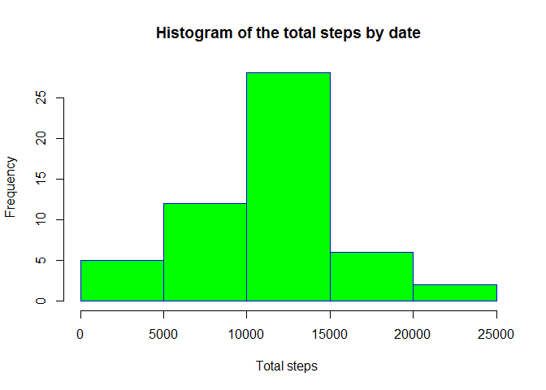
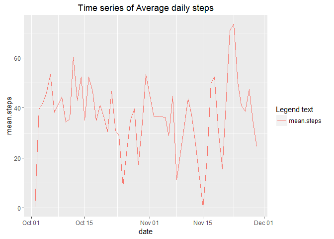
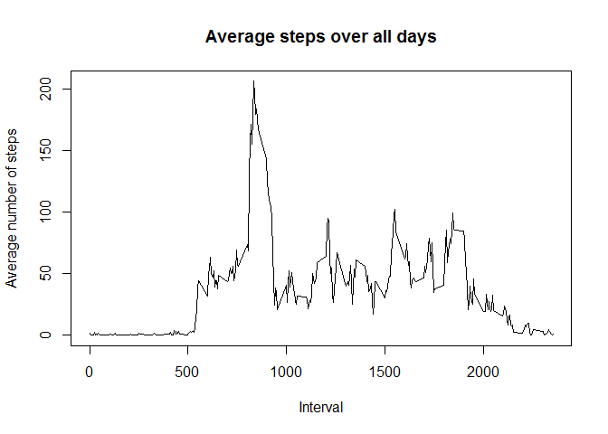
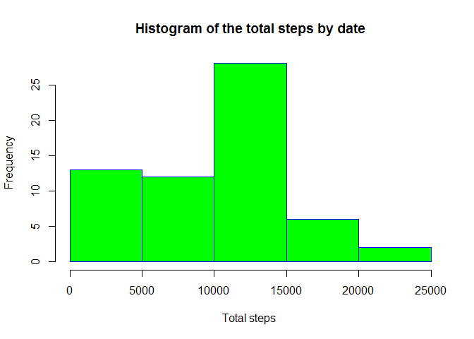
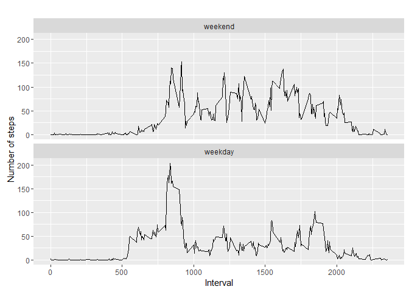

# PA1_template
Sarah Shikangah  
September 29, 2016  


## 1. Download files


```r
temp <- tempfile()
download.file("https://d396qusza40orc.cloudfront.net/repdata%2Fdata%2Factivity.zip",temp)
data <- read.csv(unz(temp, "activity.csv"))
unlink(temp)
```

## Process/transform the data for your analysis

overview check of data and omit missing data


```r
newdata <- na.omit(data)
```
## 2. Calculate the Histogram of the total number of steps taken each day


```r
total.steps <- with(newdata, aggregate(steps, by = list(date), sum))
colnames(total.steps) <- c("date", "steps")

hist(total.steps$steps, main="Histogram of the total steps by date",     xlab="Total steps ",     border="blue",     col="green")
```

<!-- -->
##3. To calculate and report the mean and median of the total number of steps taken per day
 upload required sqldf package
 

```r
library(sqldf)
```

```
## Warning: package 'sqldf' was built under R version 3.2.5
```

```
## Loading required package: gsubfn
```

```
## Warning: package 'gsubfn' was built under R version 3.2.5
```

```
## Loading required package: proto
```

```
## Loading required package: RSQLite
```

```
## Warning: package 'RSQLite' was built under R version 3.2.5
```

```
## Loading required package: DBI
```

```
## Warning: package 'DBI' was built under R version 3.2.5
```

```r
dat3 <- sqldf("SELECT date, MEDIAN(steps) AS `median.steps`, AVG(steps) AS `average.steps` 
        from `total.steps`")
```

```
## Loading required package: tcltk
```

```r
dat3
```

```
##         date median.steps average.steps
## 1 2012-11-29        10765      10766.19
```
date         median.steps    average.steps
1 2012-11-29        10765      10766.19
## 4.Time series plot of the average number of steps taken
 calculate the average number of steps
 upload required ggplot2 package
 
 
 ```r
 library(ggplot2)  # for creating graphs
 ```
 
 ```
 ## Warning: package 'ggplot2' was built under R version 3.2.5
 ```
 
 ```r
 Avr.steps <- with(newdata, aggregate(steps, by = list(date), mean))
 colnames(Avr.steps) <- c("date", "mean.steps")# relabel variables
 # preprocess data covert date to Date class
 Avr.steps$date <- as.Date(Avr.steps$date)
 
 ggplot(Avr.steps,aes(date,mean.steps))+geom_line(aes(color="mean.steps"))+ ggtitle("Time series of Average daily steps") + labs(color="Legend text")
 ```
 
 <!-- -->
## 5.The 5-minute interval that, on average, contains the maximum number of steps

```r
Steps.Interval <- aggregate(steps ~ interval, newdata, mean)
#plot time series  
plot(Steps.Interval$interval, Steps.Interval$steps, type='l', 
     main="Average steps over all days", xlab="Interval", 
     ylab="Average number of steps")
```

<!-- -->
## 6.Which 5-minute interval, on average across all the days in the dataset, contains the maximum number of steps?

```r
dat4 <- which.max(Steps.Interval$steps)
Steps.Interval[dat4, ]
```

```
##     interval    steps
## 104      835 206.1698
```
    interval    steps
104      835 206.1698
##7.Imputing missing values

Calculate and report the total number of missing values in the dataset (i.e. the total number of rows with NAs)

```r
NAdata <- sum(is.na(data$steps))
```
[1] 2304
## Create a new dataset that is equal to the original dataset but with the missing data filled in.
Replacing missing data by median

```r
dataMiss <- data
dataMiss$steps[is.na(dataMiss$steps)] <- median(data$steps, na.rm=TRUE)
```
##Make a histogram of the total number of steps taken each day and Calculate and report the mean and median total number of steps taken per day.

```r
total2.steps <- with(dataMiss, aggregate(steps, by = list(date), sum))
colnames(total2.steps) <- c("date", "steps")

hist(total2.steps$steps, main="Histogram of the total steps by date",     xlab="Total steps ",     border="blue",     col="green")
```

<!-- -->

Do these values differ from the estimates from the first part of the assignment?

```r
dat3a <- sqldf("SELECT date, MEDIAN(steps) AS `median.steps`, AVG(steps) AS `average.steps` 
              from `total2.steps`")
options(sqldf.driver = "SQLite")# to correct the error messege "Error in .verify.JDBC.result...."
dat3a
```

```
##         date median.steps average.steps
## 1 2012-11-30        10395       9354.23
```
##What is the impact of imputing missing data on the estimates of the total daily number of steps?
##Mean & median with complete data:

date median.steps average.steps
1 2012-11-30     10766.19      10766.19

##Mean & median with omitted NAs:

date         median.steps    average.steps
1 2012-11-29        10765      10766.19

....yes with imputed missing dataset has the median same as the mean.
....while the omitted NAs dataset has the median slightly different from the mean

##Create a new factor variable in the dataset with two levels - "weekday" and "weekend" indicating whether a given date is a weekday or weekend day.
Are there differences in activity patterns between weekdays and weekends?

```r
dataMiss$Wkday <- weekdays(as.POSIXct(dataMiss$date), abbreviate = T) #changing the date format to weekdays
library(timeDate)
dataMiss$wk <-isWeekday(dataMiss$date, wday=1:5)
dataMiss$Week <- factor(dataMiss$wk,levels=c(FALSE, TRUE), labels=c('weekend', 'weekday'))
```

#Make a panel plot containing a time series plot (i.e. type = "l") of the 5-minute interval (x-axis) and the average number of steps taken, averaged across all weekday days or weekend days (y-axis). 

```r
Steps.Interval2 <- aggregate(steps ~ interval + Week, dataMiss, mean)
# creat a plot
#plot time series 
 
qplot(interval, steps, data = Steps.Interval2, geom=c("line"), xlab = "Interval", 
      ylab = "Number of steps", 
      main = "") +
        facet_wrap(~ Week, ncol = 1)
```

<!-- -->
